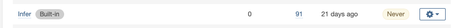
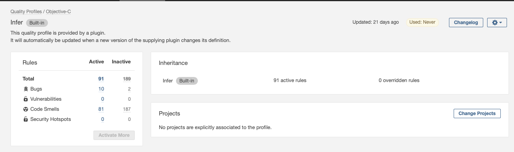
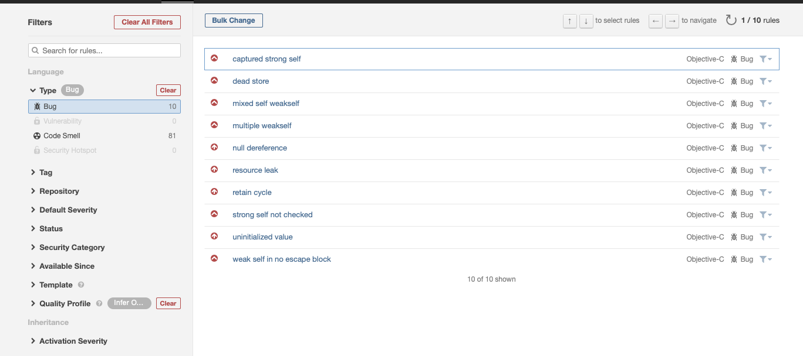

# SonarQube iOS 代码扫描插件

## English：[English](README_en.md)

## 介绍
静态代码扫描是一种检测项目代码的方式，能够在不运行代码的情况下对代码进行扫描，可以扫描出代码的 Bug (例如空指针)、漏洞、坏味道(例如方法内代码行数量过多)等，另外可以检测仓库的代码重复率，注释率，注释行，代码行数，复杂度等信息。
静态代码扫描可以在代码上线之前执行，并且具有执行成本低等特点，被广泛应用于 CI 流水线上。

SonarQube 是一个静态代码扫描服务，https://www.sonarqube.org/ ，支持主流语言的代码扫描，其社区版本在 GitHub 开源，地址：https://github.com/SonarSource/sonarqube。
但是对于部分语言，社区版本并不支持，例如 Objective-C 和 Swift ，本仓库希望解决的就是这两种语言的静态代码扫描分析。

SonarQube 作为一款成熟的代码扫描服务，对外提供了插件功能，支持将第三方的扫描工具的结果导入到SonarQube展示，本仓库基于 https://github.com/Idean/sonar-swift 二次开发，在原先功能的基础上新增了 Facebook Infer 扫描结果的导入。

本仓库作为 SonarQube 的iOS代码扫描插件，支持 Objective-C 语言和 Swift 语言，支持导入 SwiftLint、Infer、OCLint、Lizard、Fauxpas 工具的扫描分析结果。





## 规则最佳实践
我们在公司内部邀请其他同事共同Review了现有的Infer规则，筛选出了部分规则进行扫描，供大家参考。
### [规则介绍](docs/rule.md)

## 支持的工具介绍

### Infer 
Infer 是由Facebook公司推出的静态代码扫描工具，支持 C/C++/Java 语言的扫描。

链接：https://github.com/facebook/infer 

### Swiftlint
Swiftlint 是检查 Swift 代码风格和规定的静态代码分析工具，基本上以 GitHub's Swift 代码风格指南为基础，报告的问题支持在 XCode 上展示，并且可以生成报告文件，我们将读取生成的报告文件，然后上传到 SonarQube 中。

链接：https://github.com/realm/SwiftLint

### lizard
lizard 可以分析出 Objective-C 语言的圈复杂度，生成 xml 文件，导入到 SonarQube 的结果中。

链接：https://github.com/terryyin/lizard

### OCLint
OCLint 是一个针对于 C/C++/Objective-C 语言的静态代码分析工具，它与Infer不同的是，它更偏向于对代码规范一类问题的扫描，所以我们将 OCLint 部分的问题归类到 `坏味道` 上面。

链接：https://github.com/oclint/oclint

### Fauxpas
Faux Pas 是一款商业软件，支持对 Objective-C 语言进行扫描分析。

链接：http://fauxpasapp.com/

## 下载
https://github.com/tal-tech/sonar-swift/releases

## 安装
将 jar 文件放置到 SonarQube 的安装目录下的 `extensions/plugins/` 目录下，然后重启 SonarQube 

## 使用方式

参考以下脚本使用
1. 执行 `xcodebuild`，并将 log 记录输出到文件
2. 使用 xcpretty 将log日志输出为 json 格式
3. 执行 infer 分析，配置并忽略第三方的代码目录，导入刚刚的 json 编译日志
4. 执行 swiftlint ，并将结果输出到文件
5. 使用 lizard 以 xml 格式输出
6. 执行 SonarScanner ，并填写报告路径

### 参考执行脚本
```shell script
xcodebuild clean build -workspace app.xcworkspace -scheme scheme -destination 'generic/platform=iOS' COMPILER_INDEX_STORE_ENABLE=NO | tee xcodebuild.log > /dev/null
xcpretty -r json-compilation-database -o compile_commands.json < xcodebuild.log > /dev/null
# --skip-analysis-in-path 是忽略扫描目录
infer run --skip-analysis-in-path Pods --compilation-database compile_commands.json

# 可选，如果有 swift 语言使用
swiftlint lint > swiftlint.txt

lizard --xml > lizard-report.xml
sonar-scanner -Dsonar.host.url=http://sonarqube -Dsonar.projectKey=app -Dsonar.sources=. -Dsonar.swift.swiftlint.report=swiftlint.txt -Dsonar.swift.lizard.report=lizard-report.xml -Dsonar.swift.infer.report=infer-out/report.json
```

## 要求
扫描时必须在 macOS 操作系统上运行。

## 联系我们
你可以通过扫码进入微信群


## 已知用户
> 欢迎用户将公司名在 https://github.com/tal-tech/sonar-swift/issues/9 登记（仅供用户参考）

|  |  |  |
| ------------------------------------------------------------ | ------------------------------------------------------------ | ------------------------------------------------------------ |
|  |  |                                                              |

